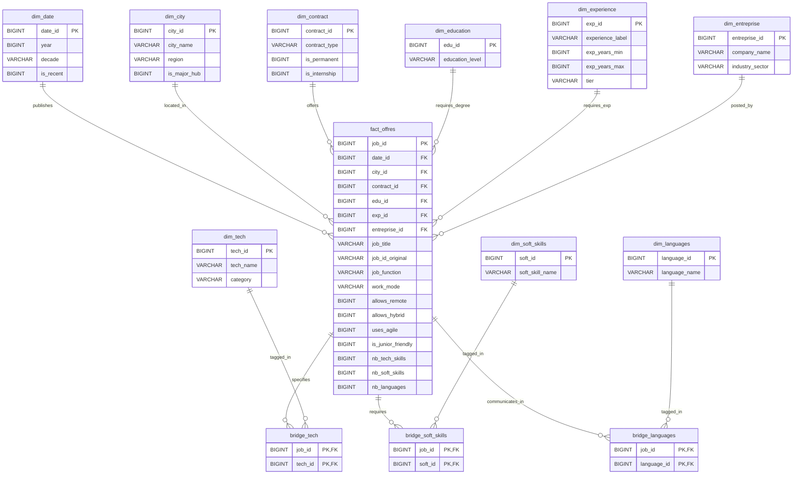

# 🗄️ TechJob Analytics — Complete Database Architecture & Data Dictionary

> **Scope:** In-Process Vectorized OLAP DuckDB Layer & Parquet Star Schema (Moroccan IT Market)  
> **Source Records:** 10,782 Normalized IT Job Postings (2016–2026)  
> **Engine:** DuckDB v1.x (In-memory zero-copy Parquet reader with <15ms execution times) + Supabase/PostgreSQL schema compatibility

---

## 1. Database Overview & Engine Architecture

TechJob Analytics uses a **Star Schema with 13 Parquet/DuckDB tables** designed for sub-15ms OLAP aggregations, co-occurrence graph queries, and dimensional multi-filtering.

### Summary Metrics:
- **Total Tables:** 13 (1 Fact, 9 Dimensions, 3 Bridge Tables)
- **Primary Fact Rows:** 10,782 job postings (`fact_offres`)
- **Total Relational Rows:** 134,801 total rows across all dimensional bridges
- **Storage Format:** Vectorized columnar Parquet with Snappy compression (`projet-data-maroc-tech/data/parquet/`)
- **Data Integrity:** 100% referential integrity (0 orphan keys, 0 unexpected NULL foreign keys)

### Table Classification:

| Category | Table Name | Row Count | Purpose |
| :--- | :--- | :--- | :--- |
| **Fact Table** | `fact_offres` | **10,782** | Central fact table containing job attributes, foreign keys, and pre-computed counts. |
| **Bridge Tables** | `bridge_tech` | **36,308** | N:M relationship mapping job postings to required technologies. |
| | `bridge_soft_skills` | **77,458** | N:M relationship mapping job postings to behavioral skills. |
| | `bridge_languages` | **7,484** | N:M relationship mapping job postings to required languages. |
| **Dimensions** | `dim_tech` | **121** | Catalog of 121 normalized tech skills categorized by domain. |
| | `dim_entreprise` | **2,767** | Normalized company directory with industry sectors. |
| | `dim_city` | **27** | Moroccan cities, regions, and major tech hub indicators. |
| | `dim_soft_skills` | **50** | Normalized behavioral and organizational skills. |
| | `dim_date` | **11** | Temporal calendar dimension spanning years 2016–2026. |
| | `dim_contract` | **7** | Employment contract types (CDI, CDD, Freelance, Stage, etc.). |
| | `dim_education` | **6** | Degree levels (Bac, Bac+2, Bac+3, Bac+4, Bac+5, Doctorat). |
| | `dim_experience` | **5** | Seniority tiers and experience brackets. |
| | `dim_languages` | **6** | Human languages (Français, Anglais, Arabe, etc.). |

---

## 2. Complete Table-by-Table Data Dictionary

---

### 1. `fact_offres` (Central Fact Table)
* **Purpose:** Stores the core job postings, metrics, workplace models, and foreign keys referencing all dimensional attributes.
* **Row Count:** 10,782

| Column Name | Data Type | Nullable | Key Type | Description & Value Examples |
| :--- | :--- | :--- | :--- | :--- |
| `job_id` | `BIGINT` | NO | **PK** | Surrogate unique primary key (e.g. `1`, `2`, `10782`). |
| `date_id` | `BIGINT` | NO | **FK** | Foreign key to `dim_date.date_id` (e.g. `1` for 2016, `10` for 2025). |
| `city_id` | `BIGINT` | NO | **FK** | Foreign key to `dim_city.city_id` (e.g. `8` for Casablanca, `20` for Rabat). |
| `contract_id` | `BIGINT` | NO | **FK** | Foreign key to `dim_contract.contract_id` (e.g. `3` for CDI, `4` for CDD). |
| `edu_id` | `BIGINT` | NO | **FK** | Foreign key to `dim_education.edu_id` (e.g. `5` for Bac+5, `3` for Bac+3). |
| `exp_id` | `BIGINT` | NO | **FK** | Foreign key to `dim_experience.exp_id` (e.g. `2` for Junior, `4` for Sénior). |
| `entreprise_id` | `BIGINT` | NO | **FK** | Foreign key to `dim_entreprise.entreprise_id` (e.g. `295` for Capgemini). |
| `job_title` | `VARCHAR` | NO | None | Job title (e.g. `'Développeur Full Stack React / Node'`, `'Data Engineer'`). |
| `job_id_original` | `VARCHAR` | YES | None | Scraped listing ID from original job board (e.g. `'846932618F'`). |
| `job_function` | `VARCHAR` | YES | None | Functional job group (e.g. `'Informatique / Electronique'`, `'Conseil / Audit'`). |
| `work_mode` | `VARCHAR` | YES | None | Raw workplace modality (e.g. `'Télétravail'`, `'Hybride'`, `'Sur site'`). |
| `allows_remote` | `BIGINT` | NO | None | Boolean flag (`1` = full remote allowed, `0` = otherwise). |
| `allows_hybrid` | `BIGINT` | NO | None | Boolean flag (`1` = hybrid work allowed, `0` = otherwise). |
| `uses_agile` | `BIGINT` | NO | None | Boolean flag (`1` = Agile/Scrum mentioned, `0` = otherwise). |
| `is_junior_friendly` | `BIGINT` | NO | None | Boolean flag (`1` = suitable for 0-2 yrs experience, `0` = otherwise). |
| `nb_tech_skills` | `BIGINT` | NO | None | Pre-calculated count of hard skills required (e.g. `4`, `7`). |
| `nb_soft_skills` | `BIGINT` | NO | None | Pre-calculated count of soft skills required (e.g. `3`, `5`). |
| `nb_languages` | `BIGINT` | NO | None | Pre-calculated count of languages required (e.g. `2`). |

---

### 2. `bridge_tech` (Many-to-Many Bridge)
* **Purpose:** Bridges job postings with multiple required technical skills for fast co-occurrence and stack matching.
* **Row Count:** 36,308

| Column Name | Data Type | Nullable | Key Type | Description & Value Examples |
| :--- | :--- | :--- | :--- | :--- |
| `job_id` | `BIGINT` | NO | **FK / PK** | Foreign key referencing `fact_offres.job_id`. |
| `tech_id` | `BIGINT` | NO | **FK / PK** | Foreign key referencing `dim_tech.tech_id`. |

---

### 3. `bridge_soft_skills` (Many-to-Many Bridge)
* **Purpose:** Bridges job postings with behavioral and communication competencies.
* **Row Count:** 77,458

| Column Name | Data Type | Nullable | Key Type | Description & Value Examples |
| :--- | :--- | :--- | :--- | :--- |
| `job_id` | `BIGINT` | NO | **FK / PK** | Foreign key referencing `fact_offres.job_id`. |
| `soft_id` | `BIGINT` | NO | **FK / PK** | Foreign key referencing `dim_soft_skills.soft_id`. |

---

### 4. `bridge_languages` (Many-to-Many Bridge)
* **Purpose:** Bridges job postings with required spoken/written languages.
* **Row Count:** 7,484

| Column Name | Data Type | Nullable | Key Type | Description & Value Examples |
| :--- | :--- | :--- | :--- | :--- |
| `job_id` | `BIGINT` | NO | **FK / PK** | Foreign key referencing `fact_offres.job_id`. |
| `language_id` | `BIGINT` | NO | **FK / PK** | Foreign key referencing `dim_languages.language_id`. |

---

### 5. `dim_tech` (Dimension)
* **Purpose:** Master catalog of technologies, frameworks, and programming languages categorized by technical domain.
* **Row Count:** 121

| Column Name | Data Type | Nullable | Key Type | Description & Value Examples |
| :--- | :--- | :--- | :--- | :--- |
| `tech_id` | `BIGINT` | NO | **PK** | Surrogate unique primary key (e.g. `1`, `2`, `121`). |
| `tech_name` | `VARCHAR` | NO | None | Canonical name (e.g. `'React'`, `'Python'`, `'Java'`, `'Docker'`, `'AWS'`). |
| `category` | `VARCHAR` | YES | None | Technology category (e.g. `'Frontend'`, `'Backend'`, `'Cloud & DevOps'`, `'Database'`, `'Data & AI'`). |

---

### 6. `dim_entreprise` (Dimension)
* **Purpose:** Directory of employers, recruiting agencies, and corporations with assigned industry sectors.
* **Row Count:** 2,767

| Column Name | Data Type | Nullable | Key Type | Description & Value Examples |
| :--- | :--- | :--- | :--- | :--- |
| `entreprise_id` | `BIGINT` | NO | **PK** | Surrogate unique primary key (e.g. `1`, `2`, `2767`). |
| `company_name` | `VARCHAR` | NO | None | Enterprise brand name (e.g. `'Capgemini'`, `'OCP Group'`, `'Attijariwafa Bank'`, `'Atos'`). |
| `industry_sector` | `VARCHAR` | YES | None | Macro sector (e.g. `'Informatique / IT'`, `'Banque / Finance'`, `'Télécoms'`). |

---

### 7. `dim_city` (Dimension)
* **Purpose:** Geographic dimension of Moroccan employment hubs and regional administrative zones.
* **Row Count:** 27

| Column Name | Data Type | Nullable | Key Type | Description & Value Examples |
| :--- | :--- | :--- | :--- | :--- |
| `city_id` | `BIGINT` | NO | **PK** | Surrogate unique primary key (e.g. `1`, `8`, `27`). |
| `city_name` | `VARCHAR` | NO | None | City name (e.g. `'Casablanca'`, `'Rabat'`, `'Tanger'`, `'Marrakech'`, `'Fès'`). |
| `region` | `VARCHAR` | YES | None | Administrative region (e.g. `'Casablanca-Settat'`, `'Rabat-Salé-Kénitra'`). |
| `is_major_hub` | `BIGINT` | NO | None | Flag (`1` = Major IT hub, `0` = Secondary hub). |

---

### 8. `dim_experience` (Dimension)
* **Purpose:** Experience brackets, numerical year bounds, and standardized seniority tiers.
* **Row Count:** 5

| Column Name | Data Type | Nullable | Key Type | Description & Value Examples |
| :--- | :--- | :--- | :--- | :--- |
| `exp_id` | `BIGINT` | NO | **PK** | Surrogate unique primary key (`1` to `5`). |
| `experience_label` | `VARCHAR` | NO | None | Experience label (e.g. `'Junior (1 - 3 ans)'`, `'Sénior (5 - 10 ans)'`). |
| `exp_years_min` | `BIGINT` | NO | None | Lower bound in years (`0`, `1`, `3`, `5`, `10`). |
| `exp_years_max` | `BIGINT` | NO | None | Upper bound in years (`1`, `3`, `5`, `10`, `20`). |
| `tier` | `VARCHAR` | NO | None | Standardized tier (e.g. `'Entry / Intern'`, `'Junior'`, `'Mid-Level'`, `'Senior'`, `'Lead / Expert'`). |

---

### 9. `dim_contract` (Dimension)
* **Purpose:** Contract typology classification.
* **Row Count:** 7

| Column Name | Data Type | Nullable | Key Type | Description & Value Examples |
| :--- | :--- | :--- | :--- | :--- |
| `contract_id` | `BIGINT` | NO | **PK** | Surrogate unique primary key (`1` to `7`). |
| `contract_type` | `VARCHAR` | NO | None | Contract name (e.g. `'CDI'`, `'CDD'`, `'Freelance'`, `'Stage'`, `'Alternance'`, `'Autre'`, `'Intérim'`). |
| `is_permanent` | `BIGINT` | NO | None | Flag (`1` for CDI, `0` otherwise). |
| `is_internship` | `BIGINT` | NO | None | Flag (`1` for Stage/Alternance, `0` otherwise). |

---

### 10. `dim_education` (Dimension)
* **Purpose:** Degree and diploma requirements.
* **Row Count:** 6

| Column Name | Data Type | Nullable | Key Type | Description & Value Examples |
| :--- | :--- | :--- | :--- | :--- |
| `edu_id` | `BIGINT` | NO | **PK** | Surrogate unique primary key (`1` to `6`). |
| `education_level` | `VARCHAR` | NO | None | Degree level (`'Bac'`, `'Bac+2'`, `'Bac+3'`, `'Bac+4'`, `'Bac+5'`, `'Doctorat'`). |

---

### 11. `dim_date` (Dimension)
* **Purpose:** Annual calendar dimension.
* **Row Count:** 11

| Column Name | Data Type | Nullable | Key Type | Description & Value Examples |
| :--- | :--- | :--- | :--- | :--- |
| `date_id` | `BIGINT` | NO | **PK** | Surrogate unique primary key (`1` to `11`). |
| `year` | `BIGINT` | NO | None | Calendar year (e.g. `2016`, `2020`, `2024`, `2025`, `2026`). |
| `decade` | `VARCHAR` | NO | None | Decade bucket (`'2010s'`, `'2020s'`). |
| `is_recent` | `BIGINT` | NO | None | Flag (`1` for years $\ge 2024$, `0` otherwise). |

---

### 12. `dim_soft_skills` (Dimension)
* **Purpose:** Normalized taxonomy of soft skills.
* **Row Count:** 50

| Column Name | Data Type | Nullable | Key Type | Description & Value Examples |
| :--- | :--- | :--- | :--- | :--- |
| `soft_id` | `BIGINT` | NO | **PK** | Surrogate unique primary key (`1` to `50`). |
| `soft_skill_name` | `VARCHAR` | NO | None | Behavioral skill (e.g. `'Travail en équipe'`, `'Rigueur'`, `'Communication'`, `'Autonomie'`). |

---

### 13. `dim_languages` (Dimension)
* **Purpose:** Spoken and written language taxonomy.
* **Row Count:** 6

| Column Name | Data Type | Nullable | Key Type | Description & Value Examples |
| :--- | :--- | :--- | :--- | :--- |
| `language_id` | `BIGINT` | NO | **PK** | Surrogate unique primary key (`1` to `6`). |
| `language_name` | `VARCHAR` | NO | None | Language name (`'Français'`, `'Anglais'`, `'Arabe'`, `'Espagnol'`, `'Allemand'`, `'Italien'`). |

---

## 3. Entity Relationships (Foreign Keys & Joins)

| Source Table | Source Column | Target Table | Target Column | Cardinality | Relationship Logic |
| :--- | :--- | :--- | :--- | :--- | :--- |
| `fact_offres` | `date_id` | `dim_date` | `date_id` | **N:1** | Each job posting is published in a specific calendar year. |
| `fact_offres` | `city_id` | `dim_city` | `city_id` | **N:1** | Each job posting belongs to a city/region. |
| `fact_offres` | `contract_id` | `dim_contract` | `contract_id` | **N:1** | Each job posting specifies a contract type (CDI, CDD, etc.). |
| `fact_offres` | `edu_id` | `dim_education` | `edu_id` | **N:1** | Each job posting requires a minimum education level. |
| `fact_offres` | `exp_id` | `dim_experience` | `exp_id` | **N:1** | Each job posting falls into an experience bracket & tier. |
| `fact_offres` | `entreprise_id` | `dim_entreprise` | `entreprise_id` | **N:1** | Each job posting is listed by a specific hiring company. |
| `bridge_tech` | `job_id` | `fact_offres` | `job_id` | **N:1** | Many tech skill tags map to one job posting. |
| `bridge_tech` | `tech_id` | `dim_tech` | `tech_id` | **N:1** | Many job postings require a specific technology. |
| `bridge_soft_skills` | `job_id` | `fact_offres` | `job_id` | **N:1** | Many soft skill tags map to one job posting. |
| `bridge_soft_skills` | `soft_id` | `dim_soft_skills` | `soft_id` | **N:1** | Many job postings require a specific soft skill. |
| `bridge_languages` | `job_id` | `fact_offres` | `job_id` | **N:1** | Many language tags map to one job posting. |
| `bridge_languages` | `language_id` | `dim_languages` | `language_id` | **N:1** | Many job postings require a specific language. |

---

## 4. Visual Mermaid ERD Diagram

